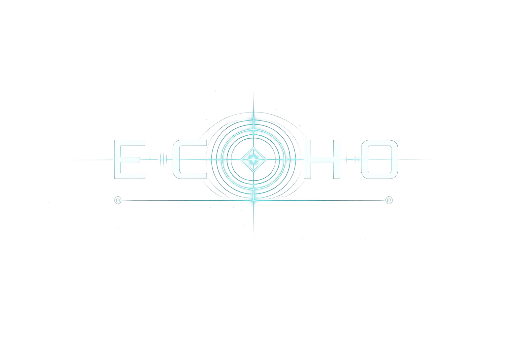

<p align="center">
  
</p>

<h1 align="center">ECHO</h1>
<p align="center"><strong>Open-Source Experimental Framework for Embodied AI Player Characters (APCs)</strong></p>

---

## 🌟 Core Concept


ECHO is an experimental framework exploring a new paradigm in game AI:

- **Shared Co-Presence**: A human-controlled player and an AI-controlled player character (APC) occupy the exact same 3D physical environment.
- **Embodied, Not a Chatbot**: The APC is an embodied entity in the game world with a physical body, location, orientation, line of sight, and navigation limits—not a floating text box or conversational agent.
- **Legal Game Actions**: The APC perceives its environment, evaluates decisions, and acts exclusively through structured legal game actions (`MOVE`, `INTERACT`, `DROP`, `SPEAK`) via standard physics and navigation systems, never by direct scene state hacking or teleportation.
- **First Proof of Concept Target**: One room, one human player, one APC, and one interactive object (`RedBox`).

---

## 🚀 Current Project Status: Phase 9 Completed

ECHO is built targeting **Godot 4.7.1 Stable**. The framework implements a complete cognitive, physical, multimodal speech, and bounded persistent-memory pipeline:

```
Microphone Capture (Push-To-Talk 'V') / Typed Console ('Enter')
       │
       ▼
Speech-to-Text Provider (Mock / OpenAI-Compatible / Local)
       │
       ▼ (Recognized Transcript)
CommandGrounder ◄── PlayerAttention Gaze Raycast ("that" / "it")
       │
       ▼ (Grounded ActionRequest / TaskRequest)
   APCBrain ───────────────► Mode Selection (DETERMINISTIC / AI)
       │                                     │
       ├─────────────────┬───────────────────┘
       ▼                 ▼
DeterministicBrain    AIBrain ──► AIService ──► OpenRouter / DeepSeek
       │                 │                             │
       │                 ▼                             │
       │         AIDecisionAdapter ◄───────────────────┘
       │                 │
       │        (Strict Validation)
       │                 │
       └─────────────────┴──────────► TaskController / ActionRequest
                                           │
                                           ├──────────────────────────┐
                                           ▼                          ▼
                                    ActionController        InteractionController
                                    (Locomotion Authority)  (Object Authority)
                                           │                          │
                                           ▼                          ▼
                                    CharacterBody3D            CarrySocket / RedBox
```

### 🧠 Cognitive, Physical & Speech Architecture Components

1. **Multimodal Speech Layer & Audio Service (`SpeechService`, `AudioCaptureService`) [Phase 8]**:
   - Push-to-talk microphone capture (**V** key) with configurable bounds (`ECHO_PTT_MIN_SECONDS` = 0.25s, `ECHO_PTT_MAX_SECONDS` = 20s).
   - Provider-neutral STT and TTS interfaces supporting `Mock`, `OpenAICompatible`, and `Local` providers.

2. **Command Grounding & Shared Attention (`CommandGrounder`, `PlayerAttention`) [Phase 8]**:
   - Grounding rules parsing spoken transcripts ("follow me", "bring me the red box", "drop it", "wait").
   - Gaze raycasting resolving relative references ("bring me that") using center-screen aim vector.
   - One-turn clarification flow ("Which object do you mean?").

3. **Structured Perception (`APCPerception`) [Phase 3]**:
   - Engine-native non-omniscient sensing evaluating distance (`max_view_distance` = 15.0m), field of view (`field_of_view_degrees` = 110.0°), and physics raycast line-of-sight occlusion.
   - Short-term memory tracking last-seen position (`memory_duration` = 3.0s).

4. **APC Brain (`APCBrain`) & Dual Modes [Phase 4 / Phase 6]**:
   - Orchestrates decision-making between `DeterministicBrain` and `AIBrain`.
   - **Automatic Fallback**: Any network failure, rate limit, timeout, or validation rejection instantly falls back to `DeterministicBrain`.

5. **Physical Object Interaction (`InteractionController` & `CarrySocket`) [Phase 7]**:
   - Sole authority for object pickup, carry socket attachment, ground placement raycasting, and giving objects to the player.

6. **Sequential Task Execution (`TaskController`) [Phase 7]**:
   - Executes multi-step trusted tasks (`BRING_OBJECT_TO_PLAYER`).

7. **Persistent Memory Layer (`MemoryService`, `MemoryPolicy`, `JSONMemoryStore`) [Phase 9]**:
   - Stores bounded, structured local memory records for trusted task outcomes and explicit player memory commands.
   - Supports session-aware recall, targeted forgetting, pruning by importance, and corruption-safe recovery.

8. **Live Debug HUD & Subtitles (F1 / F3 / F4 / F5 / V / Enter / F6 / F7)**:
   - Displays APC State, Brain Mode, AI Status, Speech Status, Subtitles Overlay, Task Status, Held Object, Perception metrics, and memory diagnostics.

---

## 🎮 Controls

| Action | Control |
| --- | --- |
| **Move** | `W` `A` `S` `D` |
| **Look Around** | `Mouse` |
| **Jump** | `Space` |
| **Release / Recapture Mouse** | `Escape` or Left Click |
| **Push-To-Talk (Hold)** | `V` |
| **Open Typed Command Console** | `Enter` |
| **Cancel Request / Task** | `F6` |
| **Toggle Debug HUD** | `F1` |
| **Test AI Connectivity** | `F3` |
| **Toggle Brain Mode** | `F4` (DETERMINISTIC / AI) |
| **Test Bring Red Box Task** | `F5` |
| **Clear All Memory (Confirm)** | `F7` |

---

## 🛡️ Privacy & Speech Safety Statement

- **Push-to-Talk Only**: The microphone records **only** while holding physical key **V** (`push_to_talk`). ECHO never listens continuously or records in the background.
- **Zero Permanent Audio Retention**: Audio samples reside strictly in runtime RAM memory (`AudioBuffer`) and are cleared immediately after transcription. No audio is saved to disk or committed to repository.
- **Offline / Local Operation**: Private, offline speech processing is fully supported using `ECHO_STT_PROVIDER=local` and `ECHO_TTS_PROVIDER=local`.

---

## 📂 Repository Structure

```
ECHO/
├── client/                     # Godot 4.7.1 Project Root
│   ├── project.godot           # Main Godot project settings & InputMap
│   ├── scenes/                 # Scene files (.tscn)
│   │   ├── main.tscn           # Main launch scene
│   │   ├── test_room.tscn      # 3D room with NavigationRegion3D, floor, walls, crate, & RedBox
│   │   ├── player.tscn         # First-person human player (CharacterBody3D)
│   │   ├── apc.tscn            # Embodied APC character with CarrySocket
│   │   └── objects/
│   │       └── red_box.tscn    # Perceivable Red Box object
│   ├── scripts/                # GDScript files (.gd)
│   │   ├── player/
│   │   │   ├── player_controller.gd  # Human player movement & camera script
│   │   │   └── player_attention.gd   # Player gaze raycast & attention snapshot script
│   │   ├── apc/
│   │   │   ├── apc_controller.gd     # APC root orchestration script
│   │   │   ├── apc_brain.gd          # Dual-mode brain orchestrator
│   │   │   ├── deterministic_brain.gd# Deterministic rule-based brain
│   │   │   ├── ai_brain.gd           # AI decision brain component
│   │   │   ├── ai_decision_adapter.gd# Tool call & payload validation adapter
│   │   │   ├── action_controller.gd  # Locomotion & action execution controller
│   │   │   ├── interaction_controller.gd # Object pickup, drop, & give controller
│   │   │   ├── task_controller.gd    # Sequential multi-step task execution controller
│   │   │   ├── task_request.gd       # Typed TaskRequest model with step expansion
│   │   │   ├── task_result.gd        # Typed TaskResult state tracking model
│   │   │   ├── carried_object_socket.gd # CarrySocket node attachment & collision manager
│   │   │   ├── action_types.gd       # Typed Action enum, ActionRequest, & ActionResult
│   │   │   └── apc_perception.gd     # Engine-native perception & FOV/LOS raycast component
│   │   ├── audio/
│   │   │   ├── audio_capture_service.gd # Push-to-talk recording service
│   │   │   ├── audio_buffer.gd       # Audio sample buffer model
│   │   │   ├── speech_service.gd     # STT and TTS provider orchestrator
│   │   │   ├── speech_to_text_provider.gd # Base STT provider interface
│   │   │   ├── text_to_speech_provider.gd # Base TTS provider interface
│   │   │   ├── speech_request.gd     # Typed speech request model
│   │   │   ├── speech_response.gd    # Typed speech response model
│   │   │   └── providers/
│   │   │       ├── stt/
│   │   │       │   ├── mock_stt_provider.gd
│   │   │       │   ├── openai_compatible_stt_provider.gd
│   │   │       │   └── local_stt_provider.gd
│   │   │       └── tts/
│   │   │           ├── mock_tts_provider.gd
│   │   │           ├── openai_compatible_tts_provider.gd
│   │   │           └── local_tts_provider.gd
│   │   ├── conversation/
│   │   │   ├── command_grounder.gd   # Spoken/typed command grounding engine
│   │   │   ├── conversation_controller.gd # Conversation state machine controller
│   │   │   ├── conversation_message.gd# Dialogue message model
│   │   │   └── response_coordinator.gd# APC response text generator
│   │   ├── ai/
│   │   │   ├── ai_service.gd         # AIService node
│   │   │   ├── ai_provider.gd        # Base AI provider class
│   │   │   ├── ai_request.gd         # Typed AI request model
│   │   │   ├── ai_response.gd        # Typed AI response model
│   │   │   └── providers/
│   │   │       ├── openrouter_provider.gd # OpenRouter provider
│   │   │       └── deepseek_provider.gd   # Direct DeepSeek provider
│   │   ├── objects/
│   │   │   ├── portable_object.gd    # Portable object base script & contract
│   │   │   └── red_box.gd            # Red Box object script extending PortableObject
│   │   ├── memory/
│   │   │   ├── memory_service.gd      # Runtime memory orchestration and query/forget flows
│   │   │   ├── memory_record.gd       # Typed memory record schema
│   │   │   ├── memory_query.gd        # Structured query filters
│   │   │   ├── memory_policy.gd       # Storage validation and privacy guards
│   │   │   ├── memory_store.gd        # Memory store interface
│   │   │   └── providers/
│   │   │       ├── json_memory_store.gd # Persistent local JSON memory store
│   │   │       └── mock_memory_store.gd # Test memory store provider
│   │   └── test_room.gd              # NavigationMesh baking & scene setup script
│   ├── ui/                     # UI overlays
│   │   ├── hud.tscn            # Debug HUD overlay scene
│   │   └── hud.gd              # Debug HUD controller script
│   └── tests/                  # Automated verification test suites
│       ├── test_phase1.gd      # Phase 1 environment & player test
│       ├── test_phase2.gd      # Phase 2 pathfinding & locomotion test
│       ├── test_phase3.gd      # Phase 3 structured perception test
│       ├── test_phase4.gd      # Phase 4 action & brain pipeline test
│       ├── test_phase5.gd      # Phase 5 AI connectivity layer test
│       ├── test_phase6.gd      # Phase 6 AI decision bridge & validation test
│       ├── test_phase7.gd      # Phase 7 object interaction & task execution test
│       ├── test_phase8.gd      # Phase 8 multimodal speech & grounding test
│       └── test_phase9.gd      # Phase 9 persistent memory test
├── docs/                       # Project Documentation
│   ├── VISION.md               # Core philosophy & vision
│   ├── ARCHITECTURE.md         # Component & cognitive pipeline architecture
│   ├── ROADMAP.md              # Multi-phase development roadmap
│   ├── AI_PROVIDERS.md         # Phase 5 provider architecture documentation
│   ├── AI_DECISION_BRIDGE.md   # Phase 6 AI decision bridge documentation
│   ├── OBJECT_INTERACTION.md   # Phase 7 object interaction architecture
│   ├── TASK_EXECUTION.md       # Phase 7 task execution architecture
│   ├── VOICE_INTERACTION.md    # Phase 8 voice interaction architecture
│   ├── COMMAND_GROUNDING.md    # Phase 8 command grounding architecture
│   ├── SHARED_ATTENTION.md     # Phase 8 shared attention architecture
│   ├── MEMORY_SYSTEM.md        # Phase 9 memory architecture and query rules
│   └── MEMORY_PRIVACY.md       # Phase 9 memory privacy and controls
├── static/                     # Repository branding & media
│   └── images/
│       └── ECHO_LOGO.png       # Official ECHO framework logo
├── .env.example                # Configuration template file
├── .gitignore                  # Godot 4.x git ignore rules
├── LICENSE                     # MIT License
└── README.md                   # Repository overview & run instructions
```

---

## 🏃 Opening and Running in Godot 4.7.1 Stable

### Prerequisites
- [Godot Engine 4.7.1 Stable](https://godotengine.org/download).

### Exact Steps to Run

#### Option 1: Via Godot Editor GUI
1. Clone this repository:
   ```bash
   git clone https://github.com/meistro57/ECHO.git
   ```
2. Launch **Godot Engine 4.7.1**.
3. Click **Import**, browse to `ECHO/client/project.godot`, and select it.
4. Click **Import & Edit**.
5. Press **F5** (or click **Play**) to launch `res://scenes/main.tscn`.

#### Option 2: Via Terminal Command Line
From the repository root directory, run:

```bash
# Launch project in 3D test room (Mock Speech & Deterministic Mode)
godot --path client/

# Launch project with AI Decision Mode & OpenAI STT/TTS Providers
ECHO_BRAIN_MODE=ai ECHO_AI_ENABLED=true OPENROUTER_API_KEY=<key> ECHO_STT_PROVIDER=openai_compatible ECHO_STT_API_KEY=<key> godot --path client/
```

To run the automated verification test suites:

```bash
# Phase 1 Test (Foundation)
godot --headless --path client/ -s tests/test_phase1.gd

# Phase 2 Test (Locomotion & Navigation)
godot --headless --path client/ -s tests/test_phase2.gd

# Phase 3 Test (Structured Perception)
godot --headless --path client/ -s tests/test_phase3.gd

# Phase 4 Test (Action & Brain Pipeline)
godot --headless --path client/ -s tests/test_phase4.gd

# Phase 5 Test (AI Provider Connectivity)
godot --headless --path client/ -s tests/test_phase5.gd

# Phase 6 Test (AI Decision Bridge & Validation)
godot --headless --path client/ -s tests/test_phase6.gd

# Phase 7 Test (Object Interaction & Task Execution)
godot --headless --path client/ -s tests/test_phase7.gd

# Phase 8 Test (Multimodal Speech, Grounding, & Execution)
godot --headless --path client/ -s tests/test_phase8.gd

# Phase 9 Test (Persistent Memory)
godot --headless --path client/ -s tests/test_phase9.gd
```

---

## ⚠️ Scope & Known Limitations (Phase 9 Baseline)

- **Single Object Target**: Currently configured for one portable object (`RedBox`).
- **Memory Is Intentionally Bounded**: Long free-form transcript storage and unrestricted autonomous memory growth are intentionally disabled.
- **Local-Only Memory**: Persistent memory is stored at `user://echo_memory.json` and can be cleared from the HUD debug section.
- **Statement**: *No combat, multiplayer, emotional simulation, autonomous goals, embeddings, or vector database feature was added.*

---

## 📜 License

This project is licensed under the [MIT License](LICENSE).
